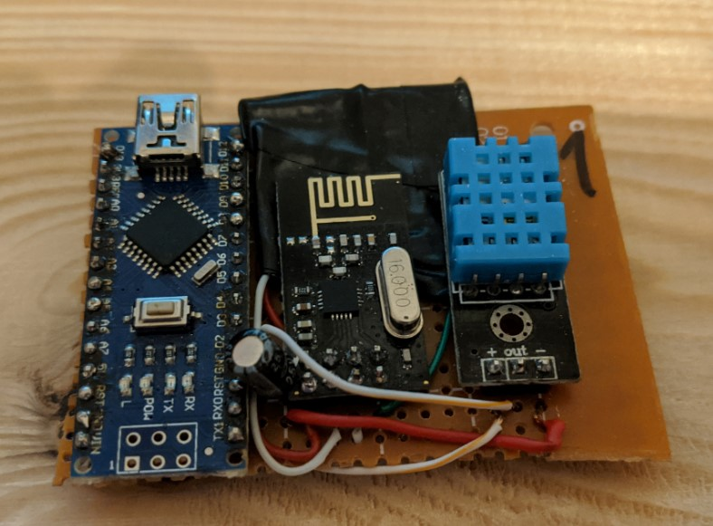

# NODE01
This is the source code for the NODE01. Bellow is the description of its functions and configuration.

Node 01 is used to send periodical measurements of temperature and humidity using DHT11 sensor.

