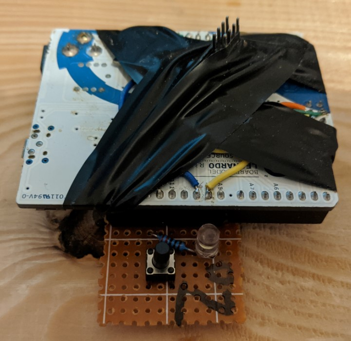

# NODE02
This is the source code for the NODE02. Bellow is the description of its functions and configuration.

Node 02 is used to send button press event when the button is pressed and receive LED PWM value which controls the brightness of the connected LED.

