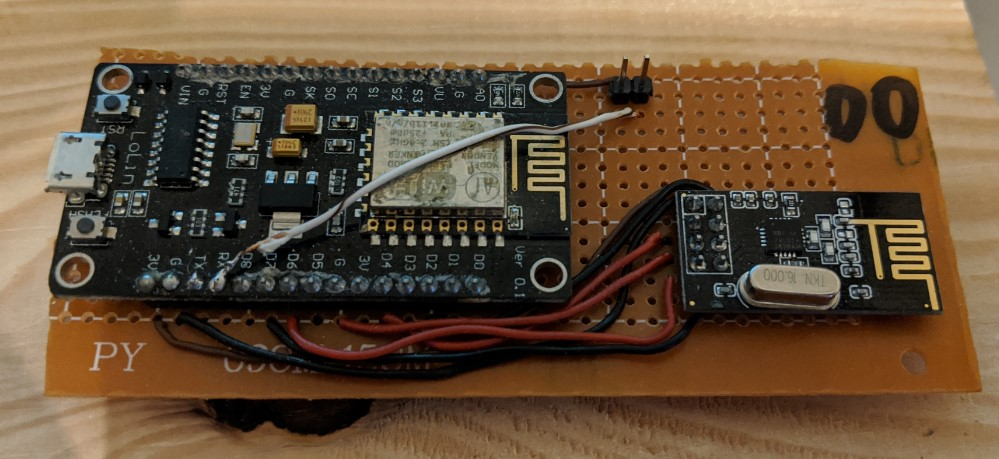
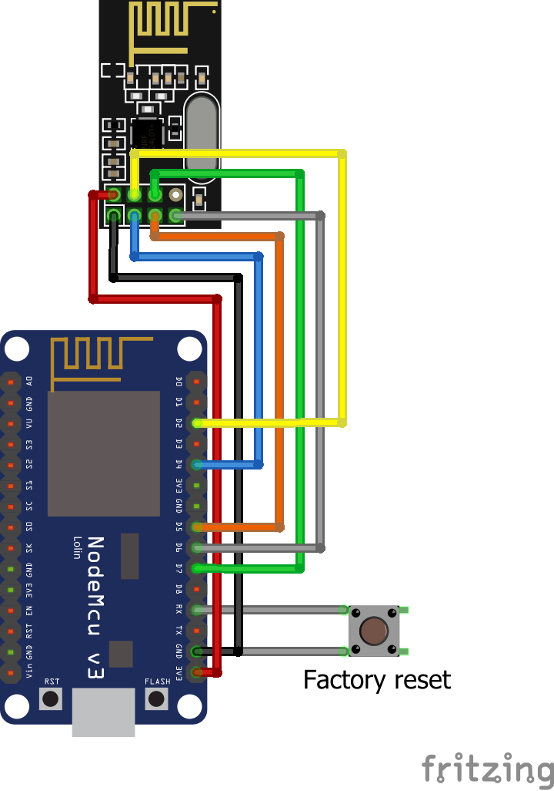

# Main gateway
This is the source code for the main gateway. Bellow is the description of its functions and configuration.

## Board

## Circuit

# Functionality
The gateway is used to collect data from all available devices and send it to the firebase server. If internet connection is unavailable, all packets are sorted into 6 files in SPIFFS according to priority. Each priority has a separate file for packets comming from the server and packets going to the server making a total of 6 files. Those files are stored internali in the SPIFFS of the ESP8266 and are formated like this:
 - **From server to nodes**: 
 Every packet is appended as a single line to the bottom of the file. Pcket format is: {address}-{int_value}
 - **From nodes to server**
 Every packet is appended as a single line to the bottom of the file. Packet format is: NODE{from_address}/{TIMESTAMP}-{JSON_PAYLOAD}

When sending data to firebase the packet format is: NODE{from_address}/{TIMESTAMP} : {JSON_PAYLOAD} 
When receiving data from firebase the packet format is: "{address}" : "{data(INT)}:{priority(1..3)}"

## Priority
Every packet should have an assigned priority. Packets with higher priority will be sent before packets with lower priority. Packets of the same priority will be sent according to their time of arrival (First In - First Out system)

Available priority levels are: 
 - **PRIORITY_LOW**: for low priority packets such as redundant measurements
 - **PRIORITY_NORMAL**: for normal priority packets such as temperature and humidity readings
 - **PRIORITY_HIGH**: for important packets such as alarms and dangerous temperatures
 - **PRIORITY_INSTANT_ONLY**: for time-sensitive packets, such as button presses or other packets that only matter for a short period of time. Packets with this priority are allways sent first, but if the network connection is not instantly available they are discarded.

# Usage

## Device setup
When ESP8266 gateway is in setup mode, it creates a local Access Point with the name `"SensorGW xx xx xx xx xx xx"`, where *"xx xx xx xx xx xx"* is a unique MAC address of the device to prevent multiple devices creating the same network name. 

In order to setup the device, user should connect to the device Access Point and send a **POST** request to this url: `http://192.168.4.1/device-setup` with the following parameters:

 - **wifiSSID** -> SSID of user's WiFi network
 - **wifiPassword** -> Password for the WiFi network
 - **ACCESS_REFRESH_TOKEN** -> *{OPTIONAL IF NOT INITIAL SETUP}* Oauth 2.0 refresh token of user's account, obtained when logging in or linking account service
 - **ACCESS_UID** -> *{OPTIONAL IF NOT INITIAL SETUP}* Unique user ID generated by firebase on registration, obtained during registration or on login
 - **ACCESS_DEVICE_ID** -> *{OPTIONAL IF NOT INITIAL SETUP}* **Unique** device identifier **for the current user**, max. 50 characters, and not necessarily globaly unique.
 
 After sending this request, the ESP8266 sends a HTTP 200 success code and a success message
 
In setup mode, there are 2 more available URLs on the device: 
 - `http://192.168.4.1/` - returns HTTP code 200, can be used to verify connection to the device. 
 - `http://192.168.4.1/available-networks` - returns JSON of available network SSID and RSSI values. Sometimes just returns an empty array... There is no way to tell which... It just performs based on how it feels at that time.... Might depend on the moon phaes, remains yet to be seen...

## Normal working mode
When ESP8266 gateway is in normal working mode it will try to collect and send as many packets as possible. 

At all times gateway is:
 - Listening for packets from nRF24 nodes
 - Trying to send available packets to nRF24 nodes
 
If internet connection is available, the gateway is also:
 - Sending packets from outgoing queue to firebase
 - Reading packets from firebase into incoming queue

# Initial configuration

## Program configuration
This section describes hard-coded "#define" values set in the Arduino IDE program

### ESP8266 configuration
 - **DEBUG** 
   - Format: *true* or *false*
   - true sends debug data to Serial port, while false is used for production 
 - **ACCESS_REFRESH_URL** 
   - Format: "`https://securetoken.googleapis.com/v1/token?key=\{API-KEY\}`"
   - `\{API-KEY\}` is the firebase project Web API key from the firebase settings
 - **ACCESS_TOKEN_POST_STRING_BEGIN**
   - Format: `"{\"grant_type\" : \"refresh_token\", \"refresh_token\" : \""`
   - First part of the POST data to be sent to aquire new ID token, refresh-token is appended programatically depending on the registered user
 -  **ACCESS_TOKEN_POST_STRING_END**
   - Format: "\" }"
   - Last part of the above string. Comes after the token. Current configuration sends JSON format as a workaround for some library issues
 - **FIREBASE_URL**
   - Format: `"\{PROJECT-NAME\}.firebaseio.com"`
   - `\{PROJECT-NAME\}` is the name of the firebase project. The whole link can usually be found on the [Firebase console](https://console.firebase.google.com/)
 - **FIREBASE_ROOT_PATH**
   - Format: `"/\{USERS-PATH\}"`
   - `\{USERS-PATH\}` is the path in the database where users are stored.
 - **DEVICE-TYPE**
   - Format: `"SENSOR-GATEWAY"`
   - This is the device type identificator. Child of `FIREBASE_ROOT_PATH/\{CURRENT-USER-ID\}` for the specified user in the database
 - **FIREBASE_DOWNSTREAM_PATH**
   - Format: `"/to_gateway"`
   - Can be changed if needed, but this is the direct child of DEVICE-TYPE in database. Contains data to be sent to the device.
 - **FIREBASE_UPSTREAM_PATH**
   - Format: `"from_gateway"`
   - Can be changed if needed, but this is the direct child of DEVICE-TYPE in database. Contains current states of the device.
 - **HTTP_TIMEOUT**
   - Format: number in **seconds**
   - Doesn't really seem to work, but this should specify the maximum waiting time for possibly failed HTTP PUT request
 - **MAX_FIREBASE_RETRIES**  
   - Format: number
   - Maximum amount of times to retry firebase downstream connection with valid internet connection before declaring expired token
 - **MAX_TOKEN_RETRIES**
   - Format: number
   - Maximum amount of times to retry ID token retrieval with valid internet connection before declaring user account change and resetting to factory settings
 - **PING_INTERVAL**
   - Format: number in milliseconds
   - How often to ping defined internet host in normal conditions to confirm Internet connection
 - **FIREBASE_FORCE_TOKEN_RELOAD_INTERVAL**
   - Format: time in millisesconds
   - How often to reload the ID token in normal conditions to make sure we're not using expired token
 - **FIREBASE_STREAM_RELOAD_INTERVAL** 
   -Format: time in milliseconds
   - How often to reload firebase receiving stream in normal conditions to make sure no unexpected situation interrupted it
 - **DEFAULT_AP_SSID** 
   - Format: String
   - Default SSID for the setup-mode Access Point. MAC address is appended to the end to make it uniqe for each device and avoid setup collision
 - **DEFAULT_APP_PASSWORD**
   - Format: String
   - Default setup AP password. Recommended length is 8 characters, but other combinations might work
 - **UTC_OFFSET_IN_SECONDS**
   - Format: number in **seconds**
   - This could allow to set timezone offset, but for the sake of keeping things syncronized with the server, leave this at 0
 - **NTP_HOST**
   - Format: String, NTP server link
   - Defines which online NTP server to use to sync current time with the device
 - **NTP_REFRESH_INTERVAL**
   - Format: number in milliseconds
   - How often to sync time with the NTP server to avoid drifting caused by internal clock inaccuracies
 - **TYPE_{device-type}**
   - Format: incrementing integer
   - This defines int values for all available sensor types. Used in processing to determin which data was sent and how to format it for firebase. Each new type added should be added in all functions that use this
 - **GATEWAY_ADDRESS**
   - Format: 00-06
   - nRF24 address of the gateway. Should allway be 00!
 - **CHANNEL**
   - Format: 0-124
   - nRF24 channel that all modules work on
 - **UNAVAILABLE_VALUE**
   - Format: number
   - This is the value sent in the packet structure for the values that the sending node does not support. Should be a value that is never expected in normal use
 - **PRIORITY_{priority-level}**
   - Format: incrementing integer
   - Defines available priority levels as integers to save memory.
 - **MAX_CONSECUTIVE_SENDS**
   - Format: integer
   - Maximum number of packets to send to firebase at once without looping through all other checks
 - **MAX_DEVICES**
   - Format: number:
   - Maximum amount of nodes (addresses) expected to be available to the gateway at some point
